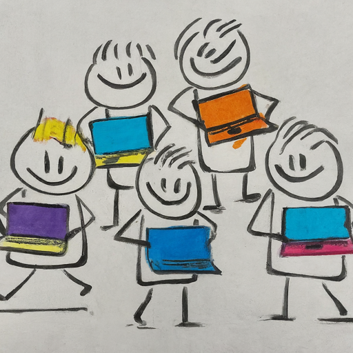

You can't just hand a hundred laptops out without significantly adapting the syllabus and the pedagogy, they told us. We refused to believe our energy and drive wouldn't be enough. We were wrong.

**Finding Inspiration**

My friend and I were in our last two years of high school. We were looking for an interesting project to take on for our SQC (Student Quality Circle, long story) project. We had been reading up on "Minimally Invasive Education: [https://wikieducator.org/Minimally_invasive_education](https://wikieducator.org/Minimally_invasive_education)" and the 'hole in the wall' project: [http://www.hole-in-the-wall.com/Mie.html](http://www.hole-in-the-wall.com/Mie.html) as pioneered by Sugata Mitra. We were far too along in our education career to benefit from something similar, but wondered if we could make a lasting change ourselves.

**The OLPC Project**

Enter the OLPC: [https://laptop.org/](https://laptop.org/) project that was being championed by a couple of senior scientists at the MIT Media Lab. For our young minds, that was a revolutionary concept at the time. One laptop, per child, to be used for education. A hundred-dollar laptop. We wanted it, for everyone.

**Partnering and Advocating**

So we partnered with a local organization: [https://www.olenepal.org/](https://www.olenepal.org/) who had received a couple of dozen prototypes for content development, and set out on a massive marketing campaign to sell the idea to the right stakeholders, and get a pilot project started at our high school.

We went to multiple management meetings, did presentations in front of the school several times, urging everybody to consider bringing in the project, to sign the MoU for the pilot. We went to a couple of schools in India, much better-resourced than ours, and pleaded our case.

A principal offered to buy a hundred units, on the spot, on behalf of the targets of the pilot project. We were unfortunately only 17, and in no position to make the connection between the funding partners and the suppliers of the laptop.

**The Challenge of Content**

The main issue the staff in our school had with the laptops was that there was not enough teaching material for the medium. You can't just hand a hundred laptops out without significantly adapting the syllabus and the pedagogy, and teacher training to follow, our teachers told us. We believed the technology would be so overwhelming, the content would follow suit, there would be no way around it. And things would be amazing!

**What Happened**

What happened: Eventually, the problem they had foreseen lasted longer than anyone had guessed. The hardware was there, it wasn't exactly a hundred dollars, and it wasn't completely bug-free, but the hardware was never the problem. There wasn't enough material to support the hardware, the educational ecosystem that had grown around paper teaching material just wasn't there. Eventually the OLPC foundation lost its way, the rest of the world caught up, laptops got much cheaper even without the OLPC, and the vision of OLPC's founders was realized, without OLPC's contribution. Perhaps it was the project that triggered 'netbooks' and later 'chromebooks', or perhaps it was a parallel evolution, but today we have the laptops, and the content to go along with it, but no OLPC.

**The Future of Educational Equity**

But that's not the end of the story. Educational inequalities and inequities exist all across the globe. Even within rich industrialized countries, under-resourced areas don't have enough digital (or otherwise) resources to properly educate young children. The promise of distraction-free teaching-learning using laptops was one borne of more optimistic times that has yet to play out fully. Privacy concerns around school laptops abound, with accusations of the laptop cameras impinging on student privacy at their homes. With generative AI models and LLM's, the promise of effective education using digital channels seems even more in doubt. Eventually, the concerns of our high-school teachers proved to be well-placed. It wasn't the technology medium that was important, the pedagogy and content mattered more. But there are causes for optimism. Khan Academy pioneered, and now leads free accessible digital education for everyone with a stable internet connection. The COVID pandemic accelerated the movement of courses into online mediums, and online-offline hybrid courses are the norm now. Physical distance will not be a hindrance for education for children in the future, if governments and communities invest in basic internet and computing resources. Education is at a point where it can be scaled. 