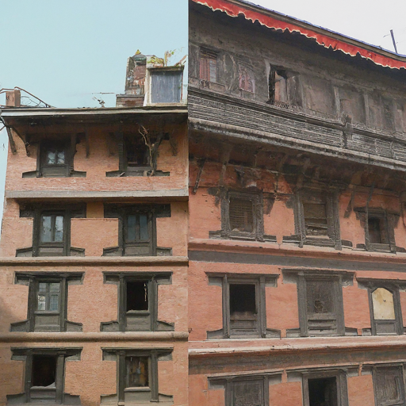
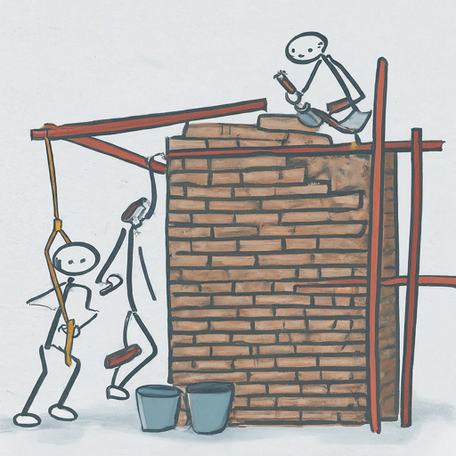

This proposal presents a unique and sustainable approach to preserving and revitalizing the traditional houses in the core cultural areas of Kathmandu and Lalitpur, Nepal. Targeting the Kathmandu and Lalitpur municipal governments and the local business community, it outlines a program that blends heritage conservation with innovative financing strategies.

### Warning: this is a pretty rough draft, has multiple edits of the same concept. It needs to be honed further. Happy to talk to anyone if interested.

**2. The Challenge and Opportunity:**

Many traditional houses in these iconic city centers face numerous challenges. Age, natural disasters, and lack of resources often lead to deterioration, threatening their cultural significance and posing safety risks. This proposal addresses this challenge by creating a win-win solution for homeowners, investors, and the community.

**3. Proposed Solution:**

Our program involves:

-   **Reconstructing** these traditional houses while adhering to strict heritage conservation guidelines.

-   **Adding new floors** to the reconstructed houses, increasing their overall usable area.

-   **Leasing the added floors** to investors seeking attractive returns in a prime location.

-   **Sharing the rental income** between homeowners and investors, providing financial benefits to both parties.

**4. Target Audience:**

-   **Primary:** Kathmandu and Lalitpur municipal governments (urban development departments)

-   **Secondary:** Construction companies, real estate investors, heritage preservation organizations, cultural tourism businesses

**5. Key Benefits:**

-   **Homeowners:** Modernized amenities, safer houses, improved living space, increased rental income, and cultural preservation of their property.

-   **Investors:** Market-beating returns, investment in a culturally significant project, and potential long-term leasehold partnerships.

-   **Community:** Enhanced cultural heritage preservation, increased tourism potential, and overall improved aesthetics of the core city areas.

-   **Government:** Improved living standards for citizens, revitalization of cultural heritage, and potential increase in tourism revenue.

**6. Addressing Concerns:**

-   **Heritage Conservation:** Collaboration with experienced architects and engineers specializing in heritage construction ensures authenticity and compliance with preservation guidelines.

-   **Community Engagement:** Transparent communication, open public forums, and addressing individual concerns will be key to gaining community buy-in.

-   **Long-Term Sustainability:** Expanding the program to new houses, attracting tourism-related businesses as investors, and establishing a dedicated project management structure will ensure long-term viability.

**7. Call to Action:**

We invite the Kathmandu and Lalitpur municipal governments and the local business community to join us in realizing this transformative project. By collaborating, we can preserve the cultural heart of these cities while creating shared prosperity and enhancing the lives of their residents.

**8. Next Steps:**

-   **Detailed feasibility study and financial projections.**

-   **Pilot project with 10-30 houses demonstrating the model's effectiveness.**

-   **Establishment of a dedicated project management team.**

-   **Marketing and outreach to potential investors and homeowners.**

By working together, we can breathe new life into Kathmandu and Lalitpur's cultural heritage, ensuring it thrives for generations to come.

**Additional Notes:**

-   This proposal is tailored to a length of approximately 1,200 words, focusing on key points and avoiding unnecessary filler.

-   You can further enhance the proposal by including visuals like maps, pictures of traditional houses, and potential architectural designs for the reconstruction.

-   Be prepared to provide detailed financial projections and cost-benefit analyses during discussions with potential partners.

We hope this revised proposal serves as a strong foundation for securing support and bringing your vision to life!

-------

Breathing New Life into Kathmandu and Lalitpur: An Essay on Sustainable Heritage Reconstruction
-----------------------------------------------------------------------------------------------

Imagine the vibrant cultural heart of Kathmandu and Lalitpur, Nepal, where centuries-old traditional houses stand as testaments to a rich history. Yet, many of these architectural gems face a harsh reality: age, natural disasters, and lack of resources leave them teetering on the brink of decay, threatening their cultural significance and posing safety risks. This essay proposes a bold and sustainable solution: a program that blends heritage conservation with innovative financing strategies, offering a win-win scenario for homeowners, investors, and the community at large.

**The Looming Challenge:**

Hundreds of traditional houses in these iconic city centers -- typically 2-3 stories, occasionally reaching 4 -- face the grim reality of deterioration. Earthquakes, like the devastating 2015 event, have exacerbated the issue, leaving many structures vulnerable to collapse. This not only threatens the cultural fabric of these communities but also poses a significant safety hazard to residents.

**A Beacon of Hope: The Proposed Solution:**

Our program offers a glimmer of hope, proposing a three-pronged approach:

-   **Meticulous Reconstruction:** We envision collaborating with experienced architects and engineers specializing in heritage construction to meticulously reconstruct these houses, adhering to strict conservation guidelines. This ensures the preservation of their architectural integrity and cultural significance.

-   **Vertical Expansion:** The reconstructed houses will have new floors added, increasing their overall usable area by an estimated 50-100%. This creates valuable additional space without compromising the traditional aesthetics.

-   **Shared Prosperity:** The added floors will be leased to investors seeking attractive returns in a prime location. Rental income will be shared between homeowners and investors, providing both parties with significant financial benefits.

**Numbers Tell the Story:**

-   **Impact on Homes:** Consider a typical 2-story house with a footprint of 200 square feet per floor. Reconstruction and a single added floor would create an additional 200 square feet of modern living space for the homeowner. Assuming a rental income of Rs. 30,000 per month for the added floor, the homeowner could see an increase of Rs. 60,000 per month, translating to a potential Rs. 2.16 crore (Rs. 3.24 crore for 45 years) over a 30-year lease period. This, coupled with improved living conditions and a safer structure, presents a compelling proposition for homeowners.

-   **Investor Enticement:** Investors, on the other hand, benefit from market-beating returns in a culturally significant location. Considering the projected growth of Nepal's tourism and commercial sectors, the value of these rental spaces is likely to appreciate significantly, offering long-term financial rewards.

**Beyond Bricks and Mortar: Community Benefits:**

This program extends its impact far beyond individual houses, revitalizing the community:

-   **Enhanced Aesthetics:** Imagine the improved appearance of the core city areas as traditional houses regain their former glory. This not only attracts tourists but also instills a sense of pride in residents.

-   **Tourism Potential:** Increased cultural heritage translates to increased tourism potential, boosting the local economy and creating jobs.

-   **Preserving Legacy:** This initiative ensures the continuation of Kathmandu and Lalitpur's unique cultural identity for future generations.

**Addressing Concerns, Ensuring Sustainability:**

Naturally, concerns regarding heritage conservation and community buy-in exist. We address these through:

-   **Transparency and Engagement:** Open communication, public forums, and addressing individual concerns will be key to gaining community trust and support.

-   **Expert Collaboration:** Partnering with heritage preservation organizations and experienced professionals ensures adherence to conservation guidelines and maintains the authenticity of the reconstruction process.

-   **Long-Term Vision:** Expanding the program to new houses, attracting tourism-related businesses as investors, and establishing a dedicated project management team will ensure long-term financial viability and community impact.

**A Call to Action:**

Breathing new life into Kathmandu and Lalitpur's cultural heart requires collaboration. We invite the Kathmandu and Lalitpur municipal governments, the local business community, and all stakeholders to join hands in realizing this transformative project. Let us leverage this innovative approach to preserve our heritage, empower our communities, and create a brighter future for these iconic cities.

**Next Steps:**

-   Conduct a detailed feasibility study with comprehensive financial projections.

-   Launch a pilot project with 10-30 houses to demonstrate the effectiveness of the model.

-   Establish a dedicated project management team to oversee implementation and community engagement.

-   Implement a robust marketing and outreach strategy to attract potential investors and homeowners.

By working together, we can turn this vision into reality, ensuring that the cultural heart of Kathmandu and Lalitpur beats strong for generations to come.

 ------------

Beyond Bricks and Mortar: Can Ancient Houses Hold the Key to Kathmandu's Soul?
------------------------------------------------------------------------------

As dusk settles over Kathmandu and Lalitpur, the golden rays paint a poignant picture on the weathered façades of centuries-old houses. These aren't merely structures; they are whispers of our history, testaments to a vibrant cultural tapestry woven over generations. Yet, beneath the fading glory lies a harsh reality: neglect, decay, and the ever-present threat of earthquakes. These architectural gems, instead of standing tall as symbols of our heritage, become burdens for their owners, choked by financial constraints and dwindling resources.

But what if this narrative could be rewritten? What if these whispers of the past could transform into an eloquent chorus, echoing not just history, but a sustainable future for our cultural heart?

This isn't a mere thought experiment; it's a bold proposal - one that envisions **rejuvenating heritage houses through meticulous reconstruction and innovative financing**. Imagine meticulously restoring these architectural gems, adhering to strict conservation guidelines, while carefully adding new floors. These additions, instead of detracting from the charm, become the key to unlocking a win-win scenario. Leased to investors seeking returns in a prime cultural location, they generate rental income. This income, shared between homeowners and investors, offers a life-changing opportunity: homeowners gain financial security and modern amenities, while investors reap market-beating returns in a culturally significant location.

The numbers paint a compelling picture. Consider a typical two-story house with a 200 sq ft footprint. Reconstruction and a single added floor translate to an extra 200 sq ft of modern living space for the homeowner. Assuming a monthly rental income of Rs. 30,000 for the added floor, the homeowner could see an increase of Rs. 60,000 a month, potentially translating to Rs. 2.16 crore over 30 years. This, coupled with improved living conditions and a safer structure, offers a life-changing opportunity.

But the benefits extend far beyond individual gains. Imagine vibrant cultural quarters where meticulously restored houses, each with its unique story, showcase their architectural elegance. Picture bustling streets lined with local artisans and shops, drawing tourists and boosting the local economy. Imagine the pride in the eyes of residents as their rich heritage is not just preserved, but woven into the fabric of a thriving city.

This vision, however, is not without its challenges. Heritage conservation is paramount, and community buy-in is crucial. Addressing these concerns is the cornerstone of our approach. Transparency and open communication will pave the way for trust and collaboration. Partnering with renowned heritage experts ensures authenticity, while dedicated project management fosters community engagement. Expanding the program to new houses and attracting tourism businesses like bed and breakfasts and museums ensures long-term sustainability and economic benefits for a wider community.

This isn't just about bricks and mortar; it's about weaving a future where heritage and progress intertwine. It's about empowering communities, preserving our identity, and ensuring that Kathmandu and Lalitpur remain cultural powerhouses for generations to come.

But it's also about more. It's about preserving the architectural knowledge and craftsmanship that have been passed down for generations. It's about fostering a renewed appreciation for traditional materials and techniques, creating opportunities for local artisans and businesses. It's about showcasing our unique cultural identity to the world, not as a relic of the past, but as a vibrant, living entity.

The time for action is now. Let us join hands -- government, communities, investors, and concerned citizens -- to breathe new life into our heritage. Let's not leave these ancient houses to crumble; let's empower them to become testaments not just to our past, but to our collective commitment to a vibrant and sustainable future.

This isn't just an op-ed; it's an invitation. Let's turn this vision into reality, brick by brick, floor by floor, community by community. Let the cultural heart of Kathmandu and Lalitpur beat strong, echoing not just the whispers of the past, but the vibrant melody of a thriving future.

Remember, this is just a starting point. You can further customize the article by adding specific examples of local businesses that could benefit, including quotes from experts on cultural preservation and economic development, and even outlining a potential timeline for implementation. The more detailed and specific you make your proposal, the more likely it is to resonate with readers and garner support.

---

Beyond Tourism: Revitalizing Kathmandu's Soul Through its Forgotten Houses
--------------------------------------------------------------------------

Kathmandu, a city where ancient temples rub shoulders with bustling bazaars, wears its history on its sleeve. Yet, nestled amidst the clamor, a silent crisis unfolds. Traditional wooden houses, their intricate carvings whispering tales of bygone eras, succumb to neglect and decay. Earthquakes leave scars, monsoon rains erode, and financial constraints leave residents grappling with an impossible choice: abandon their heritage or face an ever-growing burden.

But what if these whispers of the past could hold the key to a brighter future? A new vision proposes not just preserving Kathmandu's cultural heart, but revitalizing it, brick by intricate brick. Imagine meticulously restoring these architectural gems, adhering to strict conservation principles, while carefully adding new floors. These additions, seamlessly integrated, become the key to unlocking a transformative journey. Leased to investors seeking a stake in this vibrant cultural hub, they generate rental income. Shared between homeowners and investors, this income offers a win-win: homeowners gain financial security and modern amenities, while investors reap market-beating returns while contributing to cultural preservation.

The numbers paint a compelling picture. Consider a typical two-story house, its footprint echoing centuries of tradition. Reconstruction and a single added floor translate to an extra 200 square feet of modern living space for the homeowner. Assuming a monthly rental income of Rs. 30,000 for the added floor, the homeowner could see a significant increase in income, potentially transforming their livelihood. But the benefits extend far beyond individual gains. Imagine Kathmandu's core revitalized, its traditional quarters bustling with restored houses showcasing their unique stories. Picture bustling streets teeming with local artisans and shops, drawing tourists and boosting the local economy. Imagine the pride in the eyes of residents as their rich heritage is not just preserved, but woven into the fabric of a thriving city.

Concerns are natural. Heritage conservation is paramount, and community buy-in is crucial. Transparency and open forums will pave the way for trust and collaboration. Partnering with renowned heritage experts ensures authenticity, while dedicated project management fosters community engagement. Expanding the program to new houses and attracting tourism-related businesses like bed and breakfasts and museums ensures long-term sustainability and economic benefits for a wider community.

This is not just about bricks and mortar; it's about weaving a future where heritage and progress intertwine. It's about empowering communities, preserving cultural identity, and ensuring Kathmandu remains a cultural powerhouse for generations to come. But it's also about more. It's about preserving the architectural knowledge and craftsmanship passed down for generations. It's about fostering a renewed appreciation for traditional materials and techniques, creating opportunities for local artisans and businesses. It's about showcasing Kathmandu's unique cultural identity to the world, not as a relic of the past, but as a vibrant, living entity.

The time for action is now. Let us join hands -- government, communities, investors, and concerned citizens alike -- to breathe new life into Kathmandu's forgotten houses. Let's not leave these architectural gems to crumble; let's empower them to become testaments not just to our past, but to our collective commitment to a vibrant and sustainable future. This isn't just an op-ed; it's an invitation to rewrite the narrative, to unlock the potential that lies within Kathmandu's soul, one restored house at a time. Let the cultural heart of this ancient city beat strong, echoing not just the whispers of the past, but the vibrant melody of a thriving future.

 ---------------

Revitalizing Kathmandu's Heritage Houses: A Sustainable Solution
----------------------------------------------------------------

**30-Second Pitch:** Breathe new life into Kathmandu's historic houses by adding floors, leasing them for investor returns, and sharing profits with homeowners. This preserves heritage, improves lives, and boosts the local economy.

**Industry/Area:** Real estate, cultural preservation, tourism

**Potential Implementers:** Local government, community development organizations, private investors

**Problem/Opportunity:** Decaying traditional houses threaten cultural heritage and pose safety risks. Homeowners lack resources for restoration.

**Beneficiaries:** Homeowners gain income and improved living conditions. Investors earn market-beating returns. Community benefits from revitalized heritage and increased tourism.

**Value Creation:** Homeowners get financial security and modern amenities. Investors gain access to a unique and appreciating asset. Community enjoys cultural preservation and economic growth.

**Existing Solutions:** Similar models exist in other cities, but not focused on heritage preservation and community benefits.

**Potential Challenges:** Securing funding, ensuring community buy-in, maintaining heritage integrity during construction.

**Synergistic Partners:** Cultural preservation organizations, tourism businesses, construction companies, local artisans. They gain exposure, attract customers, and contribute to cultural revival.

**Basic Implementation Cost:** Rs. 1-2 crore per house (reconstruction, new floor) + project management costs.

**Funding Sources:** Public-private partnerships, impact investors, crowdfunding campaigns.

**Execution Plan:**

2.  **Feasibility study and detailed financial projections.**

4.  **Pilot project with 10-20 houses, demonstrating impact and securing buy-in.**

6.  **Establishment of a dedicated project management team.**

8.  **Marketing and outreach to potential investors and homeowners.**

10. **Transparent and inclusive community engagement throughout the process.**

12. **Meticulous reconstruction adhering to strict conservation guidelines.**

14. **Monitoring and evaluation to ensure long-term sustainability and impact.**

This proposal offers a sustainable and impactful solution for revitalizing Kathmandu's cultural heritage while improving lives and boosting the local economy. By collaborating and overcoming challenges, we can breathe new life into these ancient houses and secure a vibrant future for Kathmandu.

 ----

Weaving Past and Future: Reviving Kathmandu's Soul Through its Houses
---------------------------------------------------------------------

Imagine strolling through the vibrant heart of Kathmandu, not amidst crumbling facades, but past meticulously restored traditional houses, each whispering tales of a rich cultural heritage. This isn't just a daydream; it's a bold vision with the potential to transform the city's core, offering a win-win for homeowners, investors, and the community at large.

**The Looming Challenge:** Kathmandu's cultural heart harbors hundreds of traditional houses, their intricate carvings and wooden balconies standing as testaments to centuries-old craftsmanship. However, these architectural gems face a harsh reality: ravaged by time, earthquakes, and resource constraints, they stand on the brink of decay. Homeowners grapple with a difficult choice -- abandon their heritage or face a seemingly insurmountable burden of preservation.

**Beyond Preservation: An Innovative Solution:** Our proposal transcends mere preservation; it envisions **revitalization through meticulous reconstruction and innovative financing**. Each house undergoes a detailed restoration, adhering to strict conservation guidelines, while carefully adding new floors. These additions become the key, leased to investors seeking returns in a culturally significant location. Rental income, shared between homeowners and investors, offers a life-changing opportunity: homeowners gain financial security and modern amenities, while investors reap market-beating returns in a prime location.

**Numbers Tell a Compelling Story:** Consider a typical two-story house with a 200 sq ft footprint. Reconstruction and a single added floor translate to 200 sq ft of modern living space for the homeowner. Assuming a monthly rental income of Rs. 30,000 for the added floor, the homeowner could see a significant increase, potentially translating to Rs. 2.16 crore over 30 years. This, coupled with improved living conditions and a safer structure, paints a compelling picture.

**Beyond Individual Gains: Community Flourishing:** The benefits extend far beyond individual houses. Imagine vibrant cultural quarters where restored houses showcase their unique stories, attracting tourists and boosting the local economy. Picture bustling streets teeming with local artisans and shops, drawing visitors and fostering cultural exchange. Imagine the pride in the eyes of residents as their heritage is not just preserved, but woven into the fabric of a thriving city.

**Building Trust, Addressing Concerns:** Naturally, concerns regarding heritage conservation and community buy-in exist. Transparency and open communication will pave the way for trust and collaboration. Partnering with renowned heritage experts ensures authenticity, while dedicated project management fosters community engagement. Expanding the program to new houses and attracting tourism businesses like bed and breakfasts and museums ensures long-term sustainability and economic benefits for a wider community.

**More Than Bricks and Mortar: Preserving Identity:** This isn't just about bricks and mortar; it's about weaving a future where heritage and progress intertwine. It's about preserving the architectural knowledge and craftsmanship passed down for generations. It's about fostering a renewed appreciation for traditional materials and techniques, creating opportunities for local artisans and businesses. It's about showcasing Kathmandu's unique cultural identity to the world, not as a relic of the past, but as a vibrant, living entity.

**A Call to Action: Collaborating for a Brighter Future:** The time for action is now. Let us join hands -- government, communities, investors, and concerned citizens alike -- to breathe new life into Kathmandu's heritage houses. Let's not leave these architectural gems to crumble; let's empower them to become testaments not just to our past, but to our collective commitment to a vibrant and sustainable future.

**Moving from Vision to Reality:** This vision requires a well-defined execution plan:

2.  **Detailed feasibility study and financial projections:** This lays the groundwork for securing funding and demonstrating impact.

4.  **Pilot project with 10-20 houses:** This showcases the model's effectiveness and gains community buy-in.

6.  **Dedicated project management team:** This ensures smooth implementation and ongoing community engagement.

8.  **Targeted marketing and outreach:** This attracts potential investors and homeowners.

10. **Transparent and inclusive community engagement:** This builds trust and addresses concerns throughout the process.

12. **Meticulous reconstruction adhering to strict conservation guidelines:** This preserves heritage integrity.

14. **Monitoring and evaluation:** This ensures long-term sustainability and impact.

