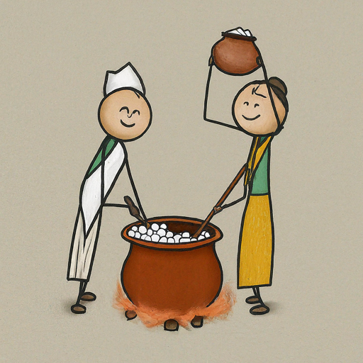
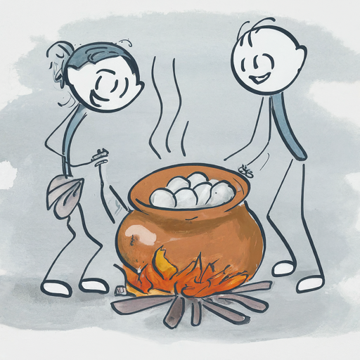

Marcha, the yeast and mold colony at the heart of Nepal's beloved fermented rice drink chhyang, remains largely undocumented, its diverse recipes passed down through generations. We will collect and recreate marcha variations, bridging the gap between tradition and science to showcase the secrets of chhyang's unique properties, and make marcha a veritable cultural heritage that's living through commercial modern channels as well.

## Introduction

Imagine immersing yourself in the colorful tradition of Nepali culture, uncovering a hidden gem that whispers tales of tradition and infuses the beloved chhyang with its distinctive character: marcha. This unique colony of mold and yeasts holds secrets waiting to be revealed, secrets that link history and science.

**Join us on an extraordinary expedition**, traversing diverse environments and collaborating with local communities, ethnic cultural organizations, and even government bodies. You'll go into the heart of traditional kitchens, learning from generations-old wisdom as you record the whispers of each unique marcha variation. Each ingredient, each step, each murmured secret becomes a woven thread in a rich tradition of cultural and scientific discovery.

But collecting recipes is just the beginning.**Explore deeper** as we recreate each variation with the expertise of our master chhyang brewer. Each  recreated chhyang becomes a bridge between tradition and science, allowing you to analyze its properties, distinct flavors, and the cultural significance whispered within.

**Experience the flavors through a rounded sensorial trip**. In a double-blind taste test, guided by relevant adjectives, you'll become a translator of chhyang's language, offering objective descriptions that reveal its hidden depths.

This is more than just research; it's a cultural revolution.**Share your findings through academic publications, workshops, and community events**, fostering knowledge dissemination and preserving Nepal's rich fermentation traditions.**Empower local communities** by promoting sustainable production practices and fair trade within the marcha and chhyang industry, contributing to economic development and uplifting those who hold the keys to this cultural treasure.

**Imagine positioning Nepal as the "capital of chhang culture,"** showcasing the diverse culture of chhyang flavors born from unique marcha variations. Like Sake for Japan and Makkoli for Korea,**see chhyang becoming a symbol of Nepal's rich heritage, attracting tourism and export opportunities.**

Unearthing the Secrets of Marcha: Finding the Science Behind Nepali Chhyang
-----------------------------------------------------------------------------

**Challenge:** Marcha, the enigmatic yeast and mold colony at the heart of Nepal's beloved chhyang, remains largely undocumented, its diverse recipes passed down through generations.

**Our Approach:**

-   **Recipe Collection:** Collaborate with communities, organizations, and government bodies to gather diverse marcha recipes and raw ingredients.

-   **Recreation:** Recreate each variation with the expertise of our master chhyang brewer, analyzing properties, flavors, and cultural significance.

-   **Sensory Analysis:** Conduct double-blind taste tests to objectively assess chhyang characteristics.

-   **Microbiological Analysis:** Employ agar cultures to reveal the microbial diversity within each marcha.

**Impact:**

-   **Cultural Preservation:** Document and share traditional knowledge, ensuring its perpetuation.

-   **Sustainable Development:** Promote fair trade and sustainable production within the marcha and chhyang industry.

-   **Economic Growth:** Position Nepal as the "capital of chhang culture," attracting tourism and export opportunities.

**Join Us:**

Contribute to this groundbreaking research and help us discover the secrets of marcha, empowering communities and elevating Nepal's chhyang culture to international recognition.

**Join us. Reveal the secrets of marcha. Go into the soul of Nepali chhyang.**

Proposal Title:

-----------------

**1. Introduction:**

We, [Your Team Name], are a passionate group of researchers dedicated to exploring the rich cultural heritage and scientific marvels of Nepal. Our current focus lies on **marcha**, a unique colony of mold and yeasts traditionally used in brewing chhyang, Nepal's beloved fermented beverage. While studies like those by Jyoti B Tamang have provided an overview of fermented foods in Nepal, a deeper dive into the diverse marcha variants, their cultural significance, and the link between marcha composition and final chhyang properties remains unexplored. This research project aims to bridge this gap, offering a **profound understanding of marcha's cultural history and its scientific influence on chhyang's characteristics**.

**2. Literature Review:**

Existing research on Nepali fermented foods, including chhyang and marcha, lays a valuable foundation for our exploration. Works by Jyoti B Tamang and others highlight the importance of these foods in Nepali culture and their potential economic significance. However, our project ventures beyond this initial research by delving into the **uncharted territory of marcha variations, their diverse cultural narratives, and their scientific influence on chhyang's final properties**. This deeper investigation could reveal knowledge about Nepal's fermentation traditions and contribute significantly to the scientific understanding of this unique microbial ecosystem.

**3. Methodology:**

**3.1 Sample Selection and Collaboration:**

-   We will select marcha samples from communities known for their unique claims and diverse cultural practices, ensuring geographical and cultural representation.

-   To achieve this, we will collaborate with local ethnic cultural organizations and governmental bodies, fostering an ethical and inclusive research process.

**3.2 Sensory and Microbiological Analysis:**

-   **Sensory Analysis:** A double-blind taste test will be conducted, where participants will choose relevant adjectives and provide weightings to describe the chhyang's characteristics. This objective evaluation will ensure unbiased results.

-   **Microbiological Analysis:** Agar culture will be used to analyze the microbial composition of each marcha sample, revealing the diversity within this ecosystem. Collaborations with experts in sensory analysis and microbial identification will further strengthen our approach.

**3.3 Addressing Limitations:**

-   While seasonal availability might pose a challenge for some fresh ingredients, marcha's traditional storage as dried flour ensures year-round accessibility, mitigating this potential limitation.

**4. Dissemination and Impact:**

-   **Sharing Knowledge:** We are committed to sharing our findings through publications in relevant academic journals, cultural workshops, and community events. This knowledge dissemination will benefit researchers, cultural enthusiasts, and local communities alike.

-   **Cultural Preservation:** By documenting and celebrating marcha's diverse cultural narratives, we aim to contribute to the preservation of Nepal's rich fermentation traditions and indigenous knowledge.

-   **Sustainable Development:** Our research will promote sustainable production and fair trade practices within the marcha and chhyang industry, benefiting local communities and contributing to economic development.

-   **Marketing Nepal's Chhyang Culture:** Our vision is to position Nepal as the "capital of chhang culture," showcasing the unique varieties of chhyang identified through this research. This could open doors for tourism opportunities and export potential, similar to how Sake represents Japan and Makkoli represents Korea.

**5. Budget and Timeline:**

A detailed budget breakdown and realistic timeline will be included in the final proposal, outlining costs associated with travel, sample collection, analysis, dissemination, and other project expenses. The timeline will provide a clear roadmap for each phase, including sample collection, analysis, data analysis, and reporting.

**6. Team Expertise:**

Our team comprises dedicated researchers with diverse expertise:

-   [Introduce team members and their qualifications, highlighting their specific roles in the project]

-   Collaborations with experts in sensory analysis and microbial identification will further strengthen our team's capabilities.

-   We are fortunate to have cultural experts and anthropologists/sociologists on board, ensuring sensitivity and respect for cultural traditions throughout the research process.

**7. Conclusion:**

This research project promises to find the intriguing link between marcha's composition and the final characteristics of chhyang, stringing the threads of cultural significance and scientific understanding. By delving into the diverse practices and traditional knowledge surrounding marcha, we aim to contribute to cultural preservation, promote sustainable development, and position Nepal as a leader in the chhyang. We are confident that our research will have a lasting impact on Nepal's cultural heritage, scientific knowledge, and economic potential.

---------------------

Within the historical tradition of Nepali culture lies a hidden gem - marcha, a unique colony of mold and yeasts cradled in flour. This ancient secret whispers tales of tradition, imbuing chhyang, Nepal's beloved fermented beverage, with its distinctive character. Yet, marcha's story remains largely untold, its diverse secrets scattered across the nation, waiting to be shown. We stand at the threshold of unexplored territory, where no documented recipes for marcha exist, where each region whispers its own unique tale. Our mission is twofold: to  collect marcha recipes and their raw ingredients, and to  recreate them.

Imagine traversing diverse areas, collaborating with local communities, ethnic cultural organizations, and even governmental bodies. We see ourselves nestled in traditional kitchens, learning from generations-old wisdom, carefully recording the whispers of each marcha variation.

But merely collecting recipes is not enough. We go deeper, recreating each variation. Our lead researcher, a master chhyang brewer, breathes life into these ancient secrets. Each  recreated chhyang becomes a bridge between tradition and science, allowing us to analyze its properties, its distinct flavors, its whispers of cultural significance.

Our sensory analysis, employing a double-blind taste test, captures the subjective symphony of flavors. Each participant, guided by relevant adjectives, becomes a translator of chhyang's language. Meanwhile, agar cultures reveal the hidden orchestra of microbes within each marcha, their diversity a proof to Nepal's unique fermentation heritage.

But our research goes beyond mere scientific exploration. We plan on sharing our findings through academic publications, cultural workshops, and community events. The knowledge gleaned will contribute to preserving Nepal's rich fermentation traditions, ensuring these whispers of the past continue to echo through generations.

Furthermore, our research can empower local communities. By promoting sustainable production practices and fair trade within the marcha and chhyang industry, we can contribute to economic development and uplift those who hold the keys to this cultural treasure.

Ultimately, our ambition is to position Nepal as the "capital of chhang culture," showcasing the diverse culture of chhyang flavors born from unique marcha variations. Like Sake for Japan and Makkoli for Korea, we see chhyang becoming a symbol of Nepal's rich cultural heritage, attracting tourism and export opportunities.

This trip is not merely about scientific discovery. It's about cultural preservation, economic empowerment, and national pride. With each collected recipe, each recreated chhyang, we hear the whispers of marcha, creating a new chapter in the story of Nepal's cultural wealth.