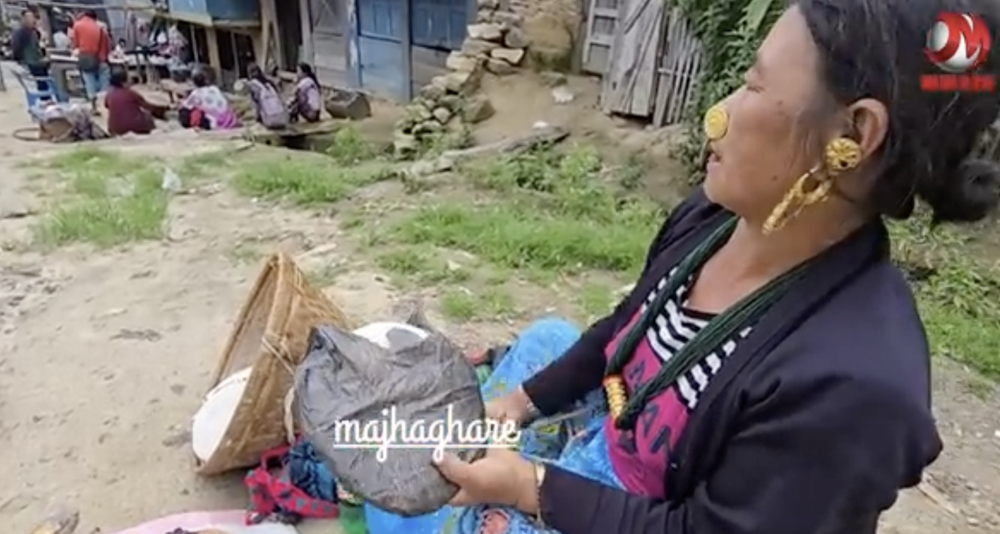

Marcha, or rice starter yeast, is a colony of mold, yeast and bacteria. Each geographical origin has a unique bio-signature. It's not a valued commodity in Nepal, but what if we preserved it and commercialized it?

---

**August 4, 2026 update:**

Turns out marcha is sold pretty actively in regional markets, at least in the eastern plains. They are sold by the multi-kilo every day. While the total value of the market is yet undetermined, there's definitely thriving commerce at a smaller scale.

Relevant video at [proper time code](https://youtu.be/AU7UouKDvgg?t=1173)


<figure style="float: left; width: 50%; margin-right: 20px; margin-bottom: 20px;">
    
    <figcaption style="text-align: center; font-size: 0.9em; margin-top: 5px; 
                      border: 1px solid #ddd; padding: 8px;">
        Image of Marcha from the Majhaghare channel.
    </figcaption>
</figure>


---

Why I care:  
Study Nepal’s traditional fermented rice drink _chhyang_ by documenting and recreating the microbial starter culture known as _marcha_, then analyse its scientific and cultural significance.

What we will do

1. Collect marcha recipes – Interview local brewers and community members across Nepal to gather traditional recipes and ingredients.
2. Recreate the starters – Use a master chhyang brewer to produce each variation in a controlled setting.
3. Analyze the products
    - Sensory evaluation – double‑blind tasting panels record flavour descriptors.
    - Microbial profiling – agar cultures identify yeast and mold species.
4. Document findings – Write reports, publish papers, and host workshops to share knowledge with academics and local communities.

Why it matters

- Preserves undocumented fermentation knowledge.
- Provides a scientific basis for the distinct flavours of chhyang.
- Supports sustainable, fair‑trade production and local economic development.
- Positions Nepal as a notable producer of traditional fermented beverages, potentially boosting tourism and export opportunities.

Next steps

- Secure collaborations with local cultural organisations and government bodies.
- Develop a detailed budget and timeline covering travel, lab work, and outreach.
- Assemble a multidisciplinary team (sensory scientists, microbiologists, anthropologists).

I want to make sure marcha and chhyang remain living cultural heritage.