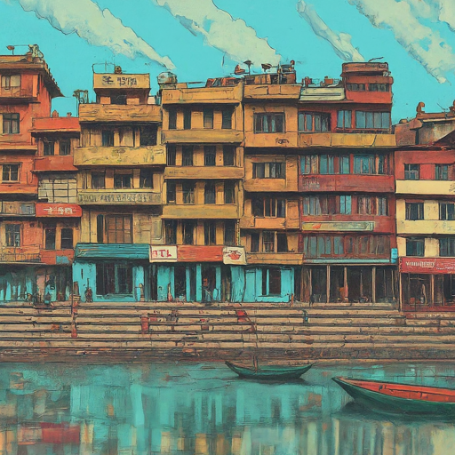
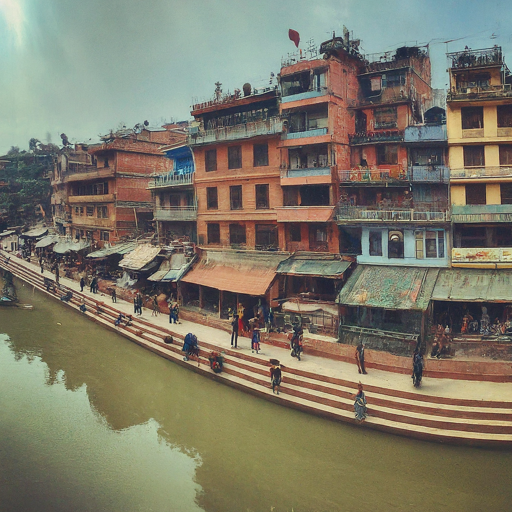
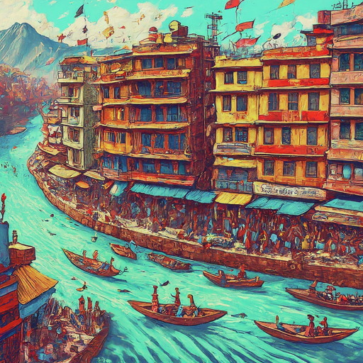

By drawing inspiration from successful models, aligning diverse interests, and supporting a spirit of shared prosperity, riverfront rejuvenation in Kathmandu and Lalitpur can change neglected waterways into successful economic hubs, cultural destinations, and sources of community pride. This proposal provides the initial vision for such a change.

**Contextualizing the Challenge:**

Kathmandu and Lalitpur's once-vibrant riverfronts face multifaceted challenges. Decades of neglect have led to:

-   **Ecological Degradation:** Untreated sewage, industrial waste, and plastic pollution poison the water, jeopardizing public health and biodiversity.

-   **Infrastructure Deficiencies:** Lack of sanitation facilities, inadequate drainage systems, and crumbling riverbanks exacerbate flooding and hygiene concerns.

-   **Community Disconnect:** Alienated residents lose access to a valuable recreational resource, creating apathy and hindering restoration efforts.

**Aligning Interests for Sustainable Solutions:**

Our approach goes beyond addressing individual challenges. We recognize the interconnectedness of issues and the crucial role of aligning diverse interests for long-term success.

-   **Residents:** Gain access to clean water, recreational spaces, and economic opportunities, improving their quality of life and well-being.

-   **Businesses:** Benefit from increased customer foot traffic, tourism potential, and a healthy workforce attracted by environmental improvements.

-   **Local Government:** Enjoys increased property values, tax revenue, and international recognition for sustainable development initiatives.

**Strategies for Shared Prosperity:**

-   **Community Ownership:** We facilitate participatory planning sessions, ensuring resident voices are heard and solutions address their needs and aspirations.

-   **Economic Incentives:** Collaborate with businesses to develop eco-tourism opportunities, riverfront markets, and sustainable waste management ventures, creating jobs and generating revenue.

-   **Skill Development:** Train local communities in sustainable practices, waste management techniques, and riverfront maintenance, empowering them to become active participants and future stewards.

-   **Public-Private Partnerships:** Forge alliances with businesses, NGOs, and government agencies to leverage resources, expertise, and funding for impactful projects.

**Pollution Abatement as a Collective Responsibility:**

Addressing pollution requires shared responsibility and innovative solutions:

-   **Incentives for Responsible Disposal:** Partner with businesses to implement waste segregation, reduction, and recycling programs. Offer tax breaks or subsidies for adopting eco-friendly practices.

-   **Public Awareness Campaigns:** Educate residents on the impact of littering and improper waste disposal. Promote community clean-up drives and incentivize responsible waste management behaviors.

-   **Decentralized Wastewater Treatment:** Explore low-cost, sustainable sanitation solutions like constructed wetlands or biodigesters, empowering communities to manage their own waste effectively.

**From Vision to Reality:**

We propose a five-year phased approach, starting with:

-   **Year 1:** Conduct an in-depth needs assessment, engage stakeholders, and develop a participatory action plan.

-   **Years 2-3:** Implement priority projects like public sanitation facilities, waste management infrastructure, and pilot green spaces.

-   **Year 4:** Expand green spaces, launch eco-tourism initiatives, and support local businesses in developing sustainable ventures.

-   **Year 5:** Conduct impact assessment, refine strategies, and ensure project sustainability through community ownership and capacity building.

**Conclusion:**

By aligning interests, supporting responsible practices, and empowering communities, riverfront rejuvenation is not just an environmental project, but a catalyst for economic growth, social well-being, and cultural revitalization. We invite you to join us in creating a future where Kathmandu and Lalitpur's rivers become exciting areas stringing together a culture of ecological health, economic prosperity, and shared community pride.

---

Riverfront Renewal: Aligning Interests, Shared Prosperity, and Thriving Waterfronts
-----------------------------------------------------------------------------------

**Imagine colorful and fun riverfronts bustling with activity, where families stroll along scenic walkways, local businesses thrive, and restaurants offer delectable cuisine with breathtaking views. This is the future we see for Kathmandu and Lalitpur's rivers, drawing inspiration from the success stories of Singapore's Clarke Quay and San Antonio's River Walk.**

**The Power of Riverfront Restaurants and Markets:**

Beyond environmental restoration and economic revitalization, our approach recognizes the power of creating vibrant cultural hubs through development of riverfront restaurants and markets. These establishments serve as:

-   **Economic Drivers:** Attracting locals and tourists, generating revenue, and creating jobs for chefs, servers, artisans, and vendors.

-   **Community Gathering Places:** Growing social connections, cultural exchange, and a sense of shared identity around the riverfront.

-   **Displays of Local Culture:** Offering authentic cuisine, artisanal crafts, and artistic performances that celebrate the rich heritage of Kathmandu and Lalitpur.

**Learning from Success: Singapore's Clarke Quay and San Antonio's River Walk:**

The thriving waterfronts of Clarke Quay and San Antonio's River Walk offer valuable lessons for our project:

-   **Combining History and Modernity:** Both destinations create historical charm with modern amenities, offering something for everyone. We can adapt this approach to display Kathmandu and Lalitpur's rich cultural heritage alongside contemporary dining and entertainment options.

-   **Diverse Culinary Experiences:** From casual cafes to fine dining restaurants, both locations cater to a variety of budgets and tastes. We can encourage similar diversity in Kathmandu and Lalitpur, highlighting local specialties alongside international cuisines.

-   **Vibrant Nightlife:** Clarke Quay and the River Walk come alive at night, attracting crowds with live music, bars, and entertainment. We can create a similar atmosphere in Kathmandu and Lalitpur, respecting local cultural norms while supporting a safe and enjoyable nocturnal experience.

-   **Pedestrian-Friendly Design:** Both waterfronts prioritize pedestrian access, encouraging strolling, exploration, and interaction. We can implement similar design principles in Kathmandu and Lalitpur, making the riverfront accessible and enjoyable for all.

**Aligning Interests for Sustainable Success:**

The success of these waterfronts hinges on aligning the interests of different stakeholders:

-   **Restaurants and Vendors:** Offer fair lease terms, training programs, and marketing support to ensure their profitability and contribution to the overall success.

-   **Residents:** Ensure responsible waste management, noise control, and security measures to maintain a positive and inclusive environment.

-   **Government:** Collaborate on infrastructure development, regulatory frameworks, and promotional activities to attract visitors and businesses.

**Conclusion:**

By drawing inspiration from successful models, aligning diverse interests, and supporting a spirit of shared prosperity, riverfront rejuvenation in Kathmandu and Lalitpur can adapt neglected waterways into successful economic hubs, cultural destinations, and sources of community pride.