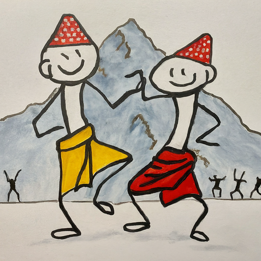

Upscaling Nepali tourism will lead to increased revenue, better infrastructure, and improved living standards. We should focus on luxury experiences and attracting premium tourists. Both the government and local communities will benefit from the initiative. This proposal offers several strategies towards that vision.

### Introduction:
Nepal has breathtaking landscapes, diverse cultures, and unique traditions. It's a captivating destination for tourists. Despite the attractions, the Nepali tourism industry has not reached its full potential. That can be changed.

#### Objectives:
1. Promote Nepal as a high-end luxury travel destination. Increase visitor satisfaction ratings and average spending per tourist
2. Train local community members to provide premium tourism services. Ensure authentic cultural experiences while generating income for their communities
3. Develop eco-friendly and culturally sensitive tourism initiatives. Encourage environmental sustainability and preserve Nepal's rich heritage
4. Grow collaborations with influential travel bloggers, influencers, and luxury travel expos. Raise awareness about the unique offerings in Nepali tourism
5. Ensure the safety and security of tourists through well-defined protocols and measures. Maintain a positive image for Nepal as a travel destination

#### Strategies:
1. Luxury Experience Creation: Improve infrastructure, create unique experiences that cannot be found elsewhere, and show premium cultural performances and ethnic cuisine to attract high-end tourists.
2. Community Involvement: Train local communities to become guides, staff, and providers of premium tourism services; engage them in community development programs, home stays, eco-tourism initiatives, and 'peace tourism' experiences.
3. Marketing Campaigns: Leverage social media platforms and collaborate with influential travel bloggers and influencers to reach potential high-end customers. Participate in luxury travel expos and events to create a strong presence for Nepali tourism.
4. Safety & Security Measures: Establish well-defined safety protocols, ensure local law enforcement agencies are trained and equipped to handle emergencies, and develop clear communication channels between the government and tourists to maintain a positive image of Nepal as a safe travel destination.

#### Success Metrics:
1. Visitor satisfaction ratings
2. Revenue per visitor
3. Average hotel prices for non-Nepali tourists
4. Improvements in community welfare

#### Leveraging Nepal as a Destination for Pink Tourism:
Nepal can become a leading destination for Pink Tourism. It can offer a safe, supportive, and engaging experience for LGBTQ travelers from around the world. By embracing this niche market, the country can drive increased tourism revenue. That will also promote greater social acceptance and equality for its local LGBTQ community. Here's some ways to accomplish that.

1. Develop safe spaces: Work with local businesses, such as hotels, restaurants, and bars, to create inclusive environments that welcome LGBTQ visitors. Offer training programs for hospitality staff. They need to be knowledgeable about the needs and preferences of their clientele.
2. Highlight progressive policies: Nepal has made strides in supporting the rights of its LGBTQ citizens. It recognizes a third gender category and has antidiscrimination protections. Promote these policies as reasons for travelers to feel comfortable and secure while visiting Nepal.
3. Organize events: Host annual events like pride parades, film festivals, or cultural celebrations. Showcase local LGBTQ talent and create a sense of community among visitors and residents alike.
4. Create unique experiences: Design tours and activities that serve the interests of the Pink Tourism market. They could include historical walks highlighting key figures in Nepal's LGBTQ history, immersive culinary experiences at local eateries, or workshops featuring traditional craftsmanship.
5. Collaborate with international organizations: Partner with global LGBTQ tourism groups and influencers to raise awareness about Nepal as a welcoming destination for the community. Tap into existing networks of potential visitors.

#### Leveraging Nepal as a Destination for Peace Tourism:
By embracing Peace Tourism, Nepal can provide an educational and immersive experience for travelers. This can also support understanding and dialogue among visitors. To leverage this niche market:

1. Develop guided tours: Create well-researched and professionally guided tours that take visitors through significant sites of the civil war and peace process. Highlight the stories of those involved and discuss the social, economic, and political factors that contributed to the conflict and its resolution.
2. Promote interactive experiences: Organize workshops, panel discussions, or cultural events where tourists can engage with local community members, peace activists, and former combatants. Encourage meaningful connections and learning firsthand about their experiences.
3. Partner with NGOs and civil society organizations: Collaborate with organizations working on conflict resolution, reconciliation, and human rights. Develop joint events that promote awareness of global peace efforts and Nepal's unique history in this regard.
4. Market unique accommodations: Offer tourists the opportunity to stay in former combatant settlements, rehabilitation centers, or community homestays. Providing an authentic glimpse into the lives of those who have been directly impacted by the conflict and peace process.
5. Display cultural resilience: Emphasize the rich cultural heritage and resilience of Nepal's ethnic communities, which have played a crucial role in maintaining social cohesion during and after the civil war. Highlight their contributions to the peace process and show how cultural exchange can promote understanding and harmony among diverse groups.

By embracing both Pink Tourism and Peace Tourism, Nepal can attract new markets of visitors. It will also promote important values of inclusion, acceptance, and conflict resolution both domestically and internationally.

#### Running a pilot project

1. Define the scope
2. Select the target area: Choose a specific region or area within Nepal that can become a premium tourist destination. The selected area should have unique
cultural attractions, natural wonders, or other factors that can be promoted as luxury experiences.
3. Gather stakeholder input: Engage local community members, tourism industry experts, government officials, and other relevant stakeholders in workshops or focus groups to discuss their vision for the upscaled tourism initiative, identify potential challenges, and gather insights on how to best tailor the pilot project to meet the needs of all parties involved.
4. Develop a detailed implementation plan: Based on the feedback gathered from stakeholders, create an in-depth plan outlining the key components of the pilot project, such as marketing strategies, community development programs, infrastructure improvements, and safety measures. Ensure that the plan includes clear milestones, timelines, and responsibilities for all involved parties.
5. Secure funding: Identify potential sources of funding, such as government grants, private investments, or international aid organizations, and work to secure the necessary financial support to execute the pilot project effectively.
6. Launch the pilot project: Implement the strategies outlined in the implementation plan, starting with community training programs, infrastructure improvements, and marketing campaigns targeting high-end tourists. Regularly monitor progress against the defined milestones and adjust the strategy as needed to address any challenges or opportunities that arise during the pilot phase.
7. Evaluate the impact: Throughout the pilot project, collect data on visitor satisfaction ratings, revenue per visitor, average hotel prices for non-Nepali tourists, and improvements in community welfare. Use this data to assess the success of the initiative and make necessary adjustments to the strategies or approaches being employed.
8. Share lessons learned and scale up: At the conclusion of the pilot project, document the key lessons learned, best practices, and any challenges faced during the implementation process. Use this information to refine the approach for a larger-scale rollout across other regions in Nepal. Additionally, share the successes and learnings with relevant stakeholders, such as local communities, tourism industry

#### Conclusion:
Upscaling the Nepali tourism industry through a focus on premium experiences and local community development can create significant economic benefits. It will also help preserve its rich cultural heritage and natural environments. Nepal can become a sought-after luxury destination. It can attract high-spending tourists, and positively affect the lives of the local communities.