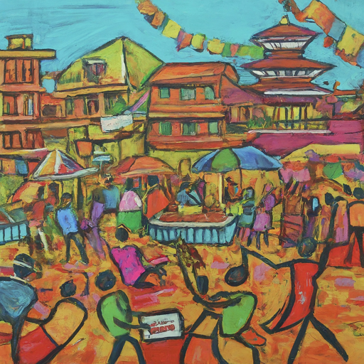

This proposal presents a solution. **Ward-level festivals** are designed to strengthen local spirit, The idea is to cultivate a sense of community ownership, and encourage civic engagement. Kathmandu and Lalitpur are cities with vibrant diverse communities and rich cultural heritage. They face challenges in fostering a strong sense of local belonging. Many residents, particularly young adults, lack engagement with their neighborhoods. This leads to issues like littering, apathy towards community events, and low political participation. 

**Understanding the Challenges:**

The lack of a strong local identity in Kathmandu and Lalitpur manifests in several ways:

-   **Low community engagement:** Residents often demonstrate limited interest in neighborhood events, leading to a fragmented social fabric.
-   **Increased littering:** Disengagement translates to a lack of ownership, reflected in widespread littering and disregard for public spaces.
-   **Apathy towards local politics:** Young adults, crucial for shaping the city's future, exhibit low voter turnout and minimal involvement in civic affairs.

These challenges hinder the development of vibrant communities and impede effective governance. This limits the cities' potential.

**The Power of Community Festivals:**

Ward-level festivals offer an opportunity to address these challenges. We propose fostering a sense of shared identity and encouraging active participation. By bringing together residents, businesses, and local organizations in a festive environment, these events can:

-   **Increase community interaction:**  Platform for residents to meet their neighbors, build relationships, and foster a sense of belonging.

-   **Promote civic engagement:** Organize workshops, discussions, and performances highlighting local issues. Spark interest in civic affairs and encourage active participation.

-   **Boost local businesses:** Provide a platform for local businesses to showcase their products and services, stimulating the local economy.

-   **Reduce littering:** Foster a sense of ownership and responsibility for shared spaces, encourage responsible waste management.

-   **Nurture cultural pride:** Instill a sense of pride in the community and its heritage. Celebrate local traditions and showcase artistic talent. 

**Envisioning the Festivals:**

These ward-level festivals will be vibrant celebrations held **four times a year**, coinciding with major holidays or seasonal events. Each festival will last for **one or two days**, offering a diverse range of activities:

-   **Competitions:** Dance, singing, art, and cooking competitions will foster healthy competition and showcase local talent.

-   **Workshops:** Educational workshops on environmental awareness, civic engagement, and skill development will empower residents.

-   **Performances:** Local musicians, artists, and cultural groups will showcase their talents, promoting cultural appreciation.

-   **Business booths:** Local businesses will have the opportunity to showcase their products and services, boosting the local economy.

-   **Community exhibits:** Local organizations and initiatives will share their work, fostering collaboration and community spirit.

-   **Food stalls:** Residents can enjoy a variety of local cuisine, further supporting local businesses and fostering social interaction.

**Sustainability and Funding:**

The sustainability of these festivals relies on a **multi-pronged approach**:

-   **Sponsorships:** Local businesses will be encouraged to sponsor the festivals, benefiting from increased visibility and goodwill.

-   **Community contributions:** Residents will be invited to contribute voluntarily, fostering a sense of ownership and shared responsibility.

-   **Municipal support:** The municipalities will provide initial funding for essential equipment and infrastructure, ensuring long-term viability.

-   **Revenue generation:** The festivals can generate revenue through stall fees, ticket sales for special events, and potential tourist attraction.

**Implementation and Management:**

The success of these festivals hinges on effective implementation and management:

-   **Ward Committees:** Each ward will establish a committee comprising residents, local businesses, and organizations to oversee planning, logistics, and execution.

-   **Volunteer participation:** Community members will be encouraged to volunteer their skills and time, fostering ownership and engagement.

-   **Transparency and accountability:** Regular communication and financial transparency will build trust and ensure responsible management.

**Measuring Impact:**

The impact of these festivals will be measured through:

-   **Increased community engagement:** Participation in events, volunteer activities, and community meetings will be tracked.

-   **Reduced littering:** Trash collection data and public surveys will gauge improvements in waste management practices.

-   **Increased voter turnout:** Voter registration and participation statistics will be monitored.

-   **Resident and business satisfaction:** Surveys will assess community sentiment and the perceived impact of the festivals.

** Challenges and solutions\
**

**Challenge 1: Funding and Resource Acquisition**

-   **Solution:** Implement a diversified funding model combining initial municipal investment, corporate sponsorships, community contributions, and potential revenue generation through stall fees, ticket sales, and tourist attraction. Explore grant opportunities and partnerships with NGOs.

-   **Challenge 2: Securing Suitable Venues**

-   **Solution:** Identify open spaces like parks, school grounds, or community centers within each ward. Negotiate with private landowners for temporary use permits if necessary. Explore possibilities of rotating venues across festivals to ensure inclusivity.

-   **Challenge 3: Ensuring Safety and Security**

-   **Solution:** Collaborate with local police and security agencies to develop comprehensive security plans. Include trained volunteers and implement crowd control measures. Establish clear emergency protocols and communication channels.

-   **Challenge 4: Managing Waste and Sanitation**

-   **Solution:** Partner with waste management companies for efficient waste collection and disposal. Set up designated waste disposal areas with clear signage and encourage responsible waste disposal through awareness campaigns.

-   **Challenge 5: Engaging Diverse Communities and Overcoming Participation Barriers**

-   **Solution:** Conduct outreach through multiple channels, including local media, community leaders, religious institutions, and social media. Offer diverse activities and competitions catering to different age groups and interests. Ensure accessibility for people with disabilities.

-   **Challenge 6: Ensuring Effective Communication and Transparency**

-   **Solution:** Establish clear communication channels through community meetings, social media platforms, and a dedicated website. Provide regular updates on planning, budgeting, and progress. Promote open communication and feedback mechanisms.

-   **Challenge 7: Maintaining Volunteer Engagement and Motivation**

-   **Solution:** Create a positive and inclusive volunteer environment with clear roles, responsibilities, and opportunities for recognition. Offer training workshops and capacity-building opportunities. Organize social events and team-building activities to foster camaraderie.

**Additional Considerations:**

-   **Weather:** Develop contingency plans for inclement weather, including alternative venues or postponements.

-   **Noise Control:** Obtain necessary permits and comply with local noise regulations. Consider the use of sound barriers and designated performance areas.

-   **Food Safety:** Ensure food vendors adhere to hygiene and safety standards through licensing and regular inspections.

The ward-level festivals can overcome logistical hurdles. They can strengthen community spirit and foster civic engagement in Kathmandu and Lalitpur. Careful planning, collaboration, and clear communication are key.

**Conclusion:**

Ward-level festivals offer a promising solution to revitalize the spirit of Kathmandu and Lalitpur. By fostering a sense of community, encouraging civic engagement, and celebrating local talent, these events can empower residents, strengthen neighborhoods, and contribute to a more vibrant and sustainable future for the cities. By investing in this initiative, the municipalities, businesses, and communities can collectively unlock the potential of Kathmandu and Lalitpur, making them truly thriving centers of culture, engagement