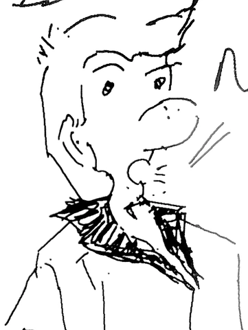

Wordiness is costly. It's important to keep it short and to the point. Ask me how I know. I'm a rambler in recovery.

This quick essay applies to the written word and the spoken word. 

I tend to ramble on. On and on and on. My signature style of creative writing (when younger) was 'stream of thought'. My logic was, surely the readers want to know the journey that brought me here. Maybe they do. Most don't, I understood out far too late. Given people's limited attention spans, it's becoming harder to retain their interest.

My mentor recently gave me the tip. Slow down. Give people time to chew on your words. Squeezing the most words into the shortest space only overwhelms readers/listeners.

Making messages long and repeating yourself does you no good. It works only if you're writing a business book, and need to stretch out 7 pages into 300. It’s taken me 30 years of my life to understand it. 

<aside class="pquote">
    <blockquote>
        
 It's hard work to not go off-the-rails. 

        
People should understand the nuances of the matter! There's so much additional context that'll help explain this better! Maybe if I try to explain the same concept in three different ways, it'll convince more people!

        
It's all for nought. Keeping messages pithy is an art. Summarizing the complexities and nuances is the point of communication. If your audience wanted to know all the details, they'd do the work. Your work as a communicator is to summarize. You distill the essence as a good writer-editor.

    </blockquote>
</aside>

Wordiness has many downsides. The first one is, your readers / listeners will stop following you. They will zone you out. Their senses will feel assaulted by the barrage of words. Being miserly with words is beneficial, it helps get the point across better.

This is the big one for me: long rambles can make people suspicious. My understanding used to be, it was important to give 'additional information'. Surely they want to understand all the subtleties and complexities? No! A ramble about subtleties, complexities, exceptions and unwarranted explanations makes people suspicious. The reader / listener assumes  that you've distilled your message, that everything is relevant.

Imagine, the listener. You've brought up your sixth point / sub-point. It's otherwise unwarranted, but you want to 'add color'.  They heard these points the latest. They imagine it just as important as your earlier points. You have successfully distracted them from you original point with something irrelevant. Their mind start to whirr. You keep mentioning "only 0.025% change of failure". But you wouldn't bring it up if it wasn't important! Surely you're hiding something! They ask questions and raise concerns, triggered by the extraneous points. They might otherwise have bought in. Now you're closer to losing them. You've divided their attention against yourself.

Wordiness undermines and distracts from the main point of your message. That's the second downside. Why bother firing a barrage of semi-relevant, possibly unimportant information at your readers? It will only confuse, and undermine the persuasiveness of your point.

The third drawback of 'comprehensive messaging' (wordiness!) is that it undermines your credibility. It presents you as a known wanderer. People tend to tune out those who go on and on. There's only so much mental attention to go around! They gotta preserve it for when you get to your point..

When you have a good point and are making it succinctly, your listeners won't trust a known rambler. They will wait for the incoming wave of additional blather. The value of your argument  will be 'averaged out' in anticipation of the incoming nonsense. You'll have your sharpened points automatically dulled out, because your audience expects so little of you. Not good!

<aside class="pquote">
    <blockquote>
        
 The real problem is the tussle between the editor self and the writer self. 

	    
 A sharp editor self won't let the message get out. But an over-empowered writer-self will undermine himself. There's a balance, and the editor self must have his say in the end.

    </blockquote>
</aside>

Ugh. Why did it take so long for me to figure this out! Why did nobody tell me this!?

Somebody told me, being succinct in writing is like adding spaces and pauses to your speeches. It lets the audience absorb the arguments, 'mind-chew' them, evaluate, and consider those seriously. A rat-tat-tat of blather doesn't let them think.

With all the options, if you don’t hold your audience’s attention, something will immediately steal it. Help your audiences -- listeners and readers -- in understanding you. Wordiness has few upsides, and guaranteed downsides.

Just learn to edit your thoughts, writings, and speeches better, man!