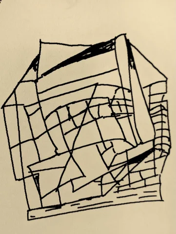

VLAH BLAH BLAH

<aside class="pquote">
    <blockquote>
		<b>Vent Part II of III.</b>
        
 This is the quote. 

         
Final part of the quote

    </blockquote>
</aside>


<figure style="float: left; width: 50%; margin-right: 20px; margin-bottom: 20px;">
    
    <figcaption style="text-align: center; font-size: 0.9em; margin-top: 5px; 
                      border: 1px solid #ddd; padding: 8px;">
        This is the figure caption for the image. It shows up nicely. One day I'll have this automated. You'll only need to pass whether left or right, and how much % of the page to occupy.
    </figcaption>
</figure>


BLAH BLAH BLAH, I'm now using a footnote[^1] And now linking a link "[Gen AI Virus](https://www.anildash.com/2025/04/30/ai_first_is_the_new_return_to_office/)" , where vendors capture the management mindshare against the interest of their organizations.  

[^1]: This is just random template stuff, do not use this. [ internal link, this is how internal links work ]()